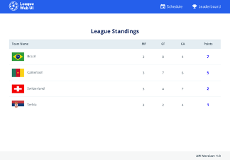
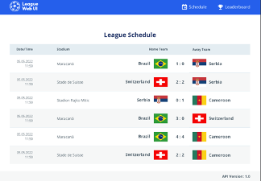

Sports League Web UI
This is a fun project where you can explore building a browser-based Single Page Application (SPA) that retrieves data from a backend API to generate and display a leaderboard based on match results. The application consists of a Schedule Page, a Leaderboard Page, and a 404 Not Found error page.

## Table of Contents
- [Screenshots](#Screenshots)
- [Features](#features)
- [Technologies Used](#technologies-used)
- [Setup and Installation](#setup-and-installation)
- [League Service](#league-service)
- [API Details](#api)


## Screenshots




## Features
- **Schedule Page**: Displays a list of matches with details such as match date, stadium, teams, and scores.
- **Leaderboard Page**: Generates a leaderboard based on match results, ordered by points with tiebreakers including head-to-head points, goal difference, and goals scored.
- **404 Not Found Page**: Custom error page displayed for undefined routes.

## Technologies Used
- **Frontend**: Vue.js
- **CSS**: Custom styles with variables for easy theming and consistency.
- **Backend API**: Simple RESTful API with endpoints to fetch the API version, access token, and match data.

## Setup and Installation
1. **Clone the repository:**
   ```bash
   git clone https://github.com/luksha6/sports-league-web-ui.git
   cd sports-league-web-ui
   ```
2. **Install dependencies:**
   ```bash
   npm install
   ```
3. **Run the backend mock server:**
   ```bash
   npx json-fake-server -m dev-mock-server-config.json
   ```
   The backend will be accessible at `http://localhost:3001`.

4. **Start the application:**
   ```bash
   npm start
   ```
5. **Access the application:**
Open your browser and navigate to `http://localhost:3000`.
API Details
- **Base URL**: `http://localhost:3001`

## League Service
The `LeagueService` class is responsible for managing the data related to the matches and generating the leaderboard. It processes the match data fetched from the API and uses it to calculate the standings based on the following rules:
1. For each victory, teams earn 3 points.
2. For each draw, teams earn 1 point.
3. The leaderboard is sorted based on the number of points in descending order.
4. If two or more teams have the same number of points, tiebreakers are applied in the following order:
   a. The first tiebreaker is the number of points in head-to-head matches between the teams.
   b. The second tiebreaker is goal difference.
   c. The third tiebreaker is the number of goals scored.
   d. The final tiebreaker is alphabetical order by team name.

## API
- **Endpoints**:
  - **GET /api/version**: Fetches the API version. No authorization required.
  - **GET /api/v1/getAccessToken**: Retrieves an access token. No authorization required.
  - **GET /api/v1/getAllMatches**: Retrieves all matches. Requires Bearer Token authorization.
